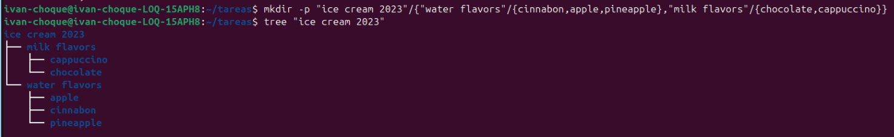
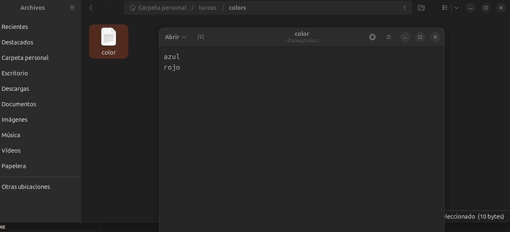
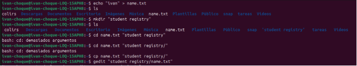
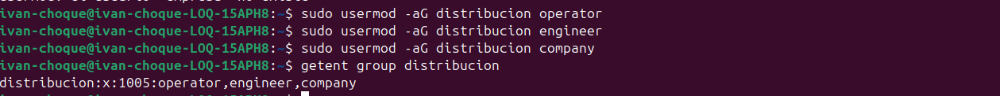
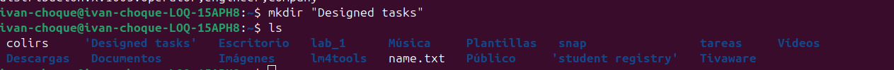
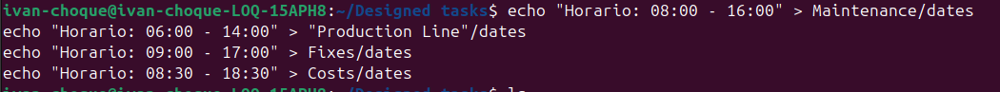
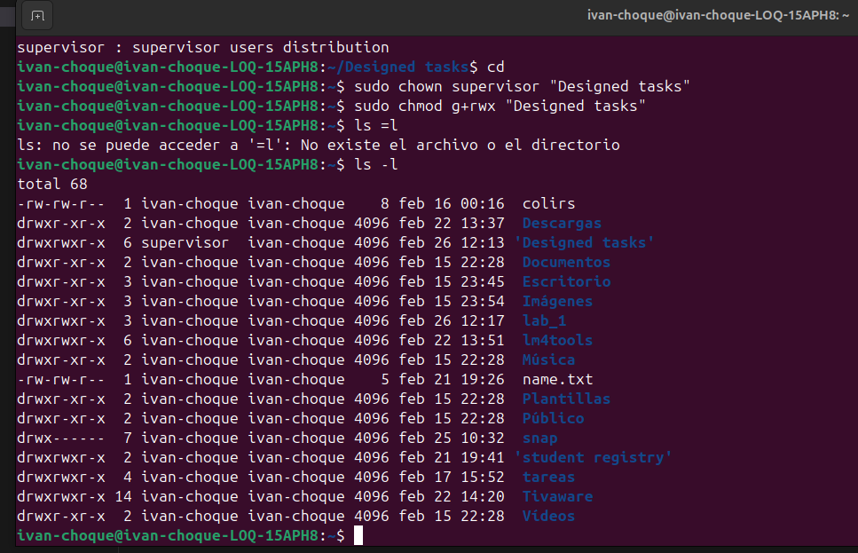

                                     I Command Line short Exercises

a). An ice cream company wants to develop a product history log for their
2023 sales campaign.
a. The company needs a main directory called ‘ice cream 2023’. Inside
this folder there should exist 2 directories: ‘water flavors’ and ‘milk
flavors. Inside the ‘water flavors’ folder 3 additional directories are
needed: “Cinnabon’ apple” and “pineapple”. For the milk ice creams
the directories are ‘chocolate’ and ‘cappuccino’. Make all the
directories tree using one command line and show it using the tree
command.

B)
Create a text file called ‘color’ with your favorite color, then move that file to a folder called ‘colors and finally add a second color. Use the cat command.
Crea un archivo de texto llamado 'color' con tu color favorito, luego mueve ese archivo a una carpeta llamada 'colors' y finalmente añade un segundo color. Usa el comando cat." 

echo "Azul" > color         # Crea un archivo llamado 'color' con el texto "Azul".
mkdir colors                # Crea una nueva carpeta o directorio llamado 'colors'.
mv color colors/            # Mueve el archivo 'color' dentro de la carpeta 'colors'.
echo "Rojo" >> colors/color # Añade el texto "Rojo" al final del archivo existente.
cat colors/color            # Muestra el contenido del archivo en la pantalla.

C) Create a txt file called ‘name’ with your first name. Then, make a copy of
that file inside a folder called ‘student registry’. Finally, add your last name
to the copy file. Use gedit command.
Crea un archivo .txt llamado "nombre" con tu nombre. Luego, haz una copia de ese archivo en una carpeta llamada "registro de estudiantes". Finalmente, agrega tu apellido al archivo copiado. Usa el comando gedit.

                                        II Command Line excercises:

1. A canning company wants to use Ubuntu as their main OS for their
activities. You have been hired to develop the following features:
a. Create a user called ‘Company’ with super user privileges.
b. Create a user called ‘Engineer’.
c. Create a user called ‘Operator’.
d. All these users must belong to the ‘Distribution’ group.

Una empresa conservera desea usar Ubuntu como sistema operativo principal para sus actividades. Se le ha contratado para desarrollar las siguientes funciones:
a. Crear un usuario llamado "Empresa" con privilegios de superusuario.
b. Crear un usuario llamado "Ingeniero".
c. Crear un usuario llamado "Operador".
d. Todos estos usuarios deben pertenecer al grupo "Distribución".

2. Utilizando el ejercicio anterior, se requiere crear un árbol de rutas con las siguientes características:
a. Crear una carpeta principal llamada "Tareas diseñadas".
b. Dentro de esa carpeta, se deben crear los directorios "Mantenimiento", "Línea de producción", "Arreglos" y "Costos".
c. Cada carpeta debe tener un archivo llamado "Fechas", que contiene los horarios específicos de los trabajadores según sus roles. Se puede seleccionar el horario para cada rol.
d. Agregar un archivo llamado "Productos" a la carpeta "Tareas diseñadas". Este archivo debe contener al menos 3 productos predefinidos de su elección.
e. Modificar los archivos de "Fechas" agregando: "Mantenimiento - Viernes", "Línea de producción - Lunes a Jueves", "Arreglos - con 2 días de anticipación" y "Costos - a fin de mes".

 Using the previous exercise is required to make a route tree with the
following features:

a. Create a main folder called ‘Designed tasks’.
mkdir "Designed tasks"

b. Inside that folder the directories: ‘Maintenance’, ‘Production Line’
‘Fixes’ and ‘Costs’ must be created.
mkdir Maintenance "Production Line" Fixes Costs
cd "Designed tasks"
mkdir Maintenance "Production Line" Fixes Costs

c. Each folder must have a file called ‘dates’ which contains specific
workers schedules according to their roles. You can select the
schedule for each role.

d. Add a file to the ‘Designed tasks’ folder called ‘Products’. This file
must contain at least 3 canned products of your choice.
echo -e "Atun\nSardina\nFrejol" > Products

e. Modify the ‘dates’ files adding: ‘Maintenance - Friday, ‘Production
line – Monday to Thursday’, ‘Fixes – with 2 days of anticipation’ and
‘Costs – at the end of the month’.

3. After some months you are contacted by the same canned company to
make some modifications to the system you developed before:
a. Create a ‘Supervisor’ user.
udo adduser supervisor

b. Add that user to the ‘Distribution’ group.
ivan-choque@ivan-choque-LOQ-15APH8:~/Designed tasks$ sudo usermod -aG distribution supervisor
ivan-choque@ivan-choque-LOQ-15APH8:~/Designed tasks$ groups supervisor

c. Modify the ‘Designed Tasks’ folder owner to be Supervisor.
//el comando chown (que significa change owner) para pasarle la propiedad al supervisor:
sudo chown supervisor "Designed tasks"

d. Modify the permissions of the ‘Designed tasks’ folder. The
‘Distribution’ group must have read, write, and execute permission.
s

sudo chmod g+rwx "Designed tasks"

